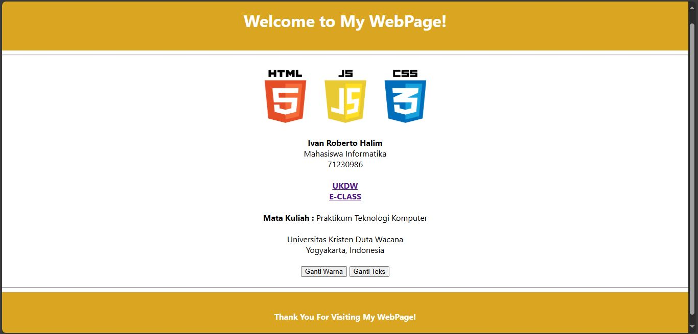

# UG12 - HTML CSS JS

Buatlah sebuah personal webpage sesuai ketentuan berikut ini :  
1. Title web jangan lupa diganti menjadi <b>NIM - Nama Kalian</b>

2. Bagian Header, berisi <b>tulisan "Welcome to My WebPage!" berwarna putih</b> dan <b>Background-Colornya : "goldenrod"</b>

3. Di bawah gambar HTML JS CSS, <b>tuliskan Nama Lengkap kalian + "Mahasiswa Informatika" + NIM kalian</b>

4. Di bawahnya, kalian <b>tuliskan teks "UKDW" dan "E-CLASS"</b>. Kemudian kalian <b>buat teks tersebut menjadi link</b> yang dapat langsung mengarahkan kalian ke web UKDW dan web E-CLASS. (https://ukdw.ac.id) - (https://eclass.ukdw.ac.id)

5. Di bawah link yang kalian buat tadi, <b>tambahkan teks "Mata Kuliah : Praktikum Teknologi Komputer"</b>, diikuti dengan <b>teks "Universitas Kristen Duta Wacana Yogyakarta, Indonesia"</b> di bawahnya.

6. <b>Buatlah sebuah tombol/button</b> yang bernama "Ganti Warna". Fungsi dari tombol ini adalah untuk <b>mengganti warna background</b> website kamu menjadi warna <b>"lightblue", "lightgreen", "pink", "silver", dan "white"</b>.

7. <b>Buatlah sebuah tombol/button</b> yang bernama "Ganti Teks". Fungsi dari tombol ini adalah untuk <b>mengganti teks di Header</b> website kamu menjadi <b>"Hello World!", "Coding is Fun!", "I love JS!", "Welcome to My WebPage!", "Enjoy Your Visit!"</b>.

8. Bagian Footer, berisi <b>tulisan "Thank You For Visiting My WebPage!" berwarna putih</b> dan <b>Background-Colornya : "goldenrod"</b>

## Catatan
- Buatlah source code untuk mengatur style di file style.css
- Buatlah source code untuk mengatur fungsi tombol di file script.js
- Usahakan semirip mungkin dengan Referensi di bawah yaa

## Referensi

